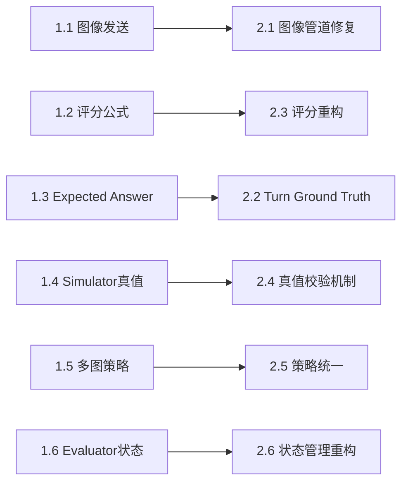

# Phase 1 执行指南：验证与诊断

## 概述

Phase 1包含6个验证任务，分为3个并行组（A、B、C），目标是验证评审意见中的所有问题并量化其严重程度。

## 任务列表

| ID | 任务名称 | 优先级 | 难度 | 预估时间 | 并行组 |
|----|---------|-------|------|---------|--------|
| 1.1 | 图像发送验证 | P0 | Medium | 3h | A |
| 1.2 | 评分公式验证 | P0 | Hard | 4h | A |
| 1.3 | Expected Answer追踪 | P1 | Hard | 5h | B |
| 1.4 | Simulator提示词检查 | P1 | Medium-Hard | 5h | B |
| 1.5 | 多图策略一致性 | P1 | Medium | 4h | C |
| 1.6 | 评估器状态追踪 | P2 | Medium-Hard | 4-5h | C |

**总预估时间**:
- 串行: 25-26小时
- 并行（3个窗口）: 9-10小时

## 并行执行策略

### 方案1: 3个窗口并行（推荐）

```
窗口1（最紧急）: Task 1.1 + 1.2
  ├─ Task 1.1: 图像发送验证 (3h)
  └─ Task 1.2: 评分公式验证 (4h)
  总计: 7h（并行执行，取较长者4h）

窗口2（Turn逻辑）: Task 1.3 + 1.4
  ├─ Task 1.3: Expected Answer追踪 (5h)
  └─ Task 1.4: Simulator提示词检查 (5h)
  总计: 10h（并行执行，取较长者5h）

窗口3（多图和状态）: Task 1.5 + 1.6
  ├─ Task 1.5: 多图策略一致性 (4h)
  └─ Task 1.6: 评估器状态追踪 (4-5h)
  总计: 9h（并行执行，取较长者5h）
```

**优势**:
- 最大化并行度
- 每个窗口关注相关的问题域
- 可以分配给3个开发者/LLM会话

**执行顺序**:
1. 三个窗口同时启动
2. 窗口1最先完成（约4h）
3. 窗口3其次（约5h）
4. 窗口2最后（约5h）

### 方案2: 优先级驱动（保守）

```
第一波（P0）: Task 1.1 + 1.2（并行）
  完成后 → 汇总 → 决定是否继续

第二波（P1）: Task 1.3 + 1.4 + 1.5（并行）
  完成后 → 汇总

第三波（P2）: Task 1.6
```

**优势**:
- 优先解决最致命问题
- 可以根据P0结果调整后续计划

## 任务依赖关系



**关键点**:
- Phase 1任务内部无依赖，可以完全并行
- Phase 2任务依赖对应的Phase 1结果
- 必须等Phase 1全部完成才能进入Phase 2

## 输出规范

### 每个任务必须产生：

1. **验证报告（JSON）**
   - 路径: `round3/results/phase1_<task_id>_<name>.json`
   - 格式: 见各任务文档
   - 必须字段: validation_id, timestamp, status, severity, root_cause

2. **人类可读报告（TXT/MD）**
   - 路径: `round3/results/phase1_<task_id>_<name>.txt`
   - 包含: 问题总结、证据、根因分析、修复建议

3. **详细日志**
   - 路径: `round3/logs/phase1_<task_id>_debug.log`
   - 包含所有中间分析步骤

4. **Case列表（如果适用）**
   - CSV格式，列出所有异常/问题cases
   - 便于后续人工审查

### 数据存放结构

```
round3/
├── results/
│   ├── phase1_1.1_image_sending.json
│   ├── phase1_1.1_image_sending.txt
│   ├── phase1_1.2_score_calculation.json
│   ├── phase1_1.2_score_calculation.txt
│   ├── phase1_1.2_anomaly_cases.csv
│   ├── phase1_1.3_expected_answer.json
│   ├── phase1_1.3_expected_answer.txt
│   ├── phase1_1.3_misjudged_cases.csv
│   ├── phase1_1.4_simulator_truth.json
│   ├── phase1_1.4_simulator_truth.txt
│   ├── phase1_1.4_false_confirmations.csv
│   ├── phase1_1.5_multi_image.json
│   ├── phase1_1.5_multi_image.txt
│   ├── phase1_1.6_evaluator_state.json
│   ├── phase1_1.6_evaluator_state.txt
│   └── phase1_summary.md（汇总）
├── logs/
│   ├── phase1_1.1_debug.log
│   ├── phase1_1.2_debug.log
│   ├── phase1_1.3_debug.log
│   ├── phase1_1.4_debug.log
│   ├── phase1_1.5_debug.log
│   └── phase1_1.6_debug.log
└── scripts/
    ├── debug_image_sending.py
    ├── debug_score_calculation.py
    ├── debug_expected_answer_tracking.py
    ├── debug_simulator_truth_validation.py
    ├── debug_multi_image_strategy.py
    └── debug_evaluator_state_tracking.py
```

## 成功标准

### Phase 1整体成功标准：

- [ ] 所有6个任务的脚本运行无错误
- [ ] 所有评审意见中的问题都被验证（确认存在或不存在）
- [ ] 每个问题都有量化的严重程度（P0/P1/P2）
- [ ] 根因定位到具体代码位置（文件名、函数名、行号）
- [ ] 生成了Phase 2所需的所有输入数据

### 各任务成功标准：

见各任务文档的"成功标准"部分。

## 质量保证

### 验证脚本质量要求：

1. **可复现**: 其他人可以独立运行脚本得到相同结果
2. **鲁棒性**: 处理缺失数据、异常格式等边界情况
3. **可审查性**: 输出详细的中间步骤和证据
4. **量化**: 所有结论都有数据支持

### Peer Review建议：

- 每个任务完成后，由另一个窗口的负责人快速review
- 重点检查：
  - 统计数据是否合理
  - 根因分析是否有代码证据
  - 修复建议是否可行

## 风险管理

### 可能遇到的问题：

1. **日志格式不一致**: 不同时间的run logs可能格式不同
   - 应对: 脚本应该检测格式并适配

2. **数据量不足**: 某些类型的任务可能数据少
   - 应对: 在用户指定的新日志目录查找更多数据

3. **问题不存在**: 某些评审问题可能在特定日志中不明显
   - 应对: 扩大搜索范围，或标记为"需要更多数据"

4. **根因难以定位**: 某些问题可能涉及复杂交互
   - 应对: 提供多个候选根因，在Phase 2中验证

## 下一步

Phase 1完成后，需要：

1. **汇总Phase 1结果**
   - 运行汇总脚本生成 `phase1_summary.md`
   - 包含所有问题的优先级排序

2. **召开Phase 1评审会**
   - 审查所有验证结果
   - 确认修复优先级
   - 调整Phase 2计划

3. **启动Phase 2**
   - 根据Phase 1结果，决定Phase 2的任务顺序
   - 可能需要调整某些修复方案

---

**开始执行**:
- 选择并行方案（推荐方案1）
- 创建3个窗口/会话
- 同时启动所有任务
- 定期同步进度

**预计完成时间**:
- 并行执行: 5-6小时
- 串行执行: 25-26小时
